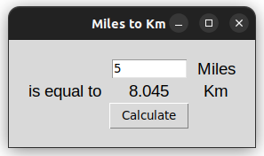

# Miles to Kilometer GUI Application

### Tejas Acharya [twitter](https://twitter.com/achte_te)

A GUI application to convert Miles to Kilometer.

### Requirements:

[Python](https://www.python.org/)

[Tkinter](https://docs.python.org/3/library/tkinter.html)

### To Run:

```sh
git clone git@github.com:achte-2022/Miles-To-Kilometer.git
cd Miles-To-Kilometer
python3 main.py
```

### Application Screen:


